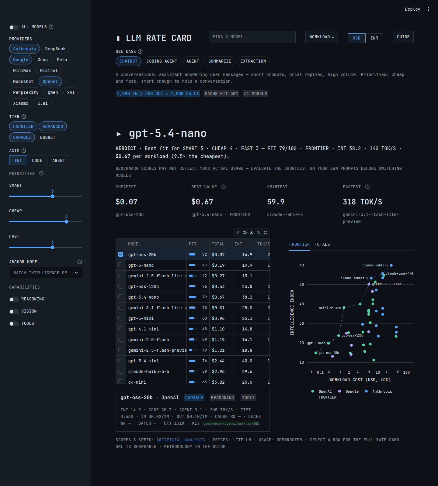
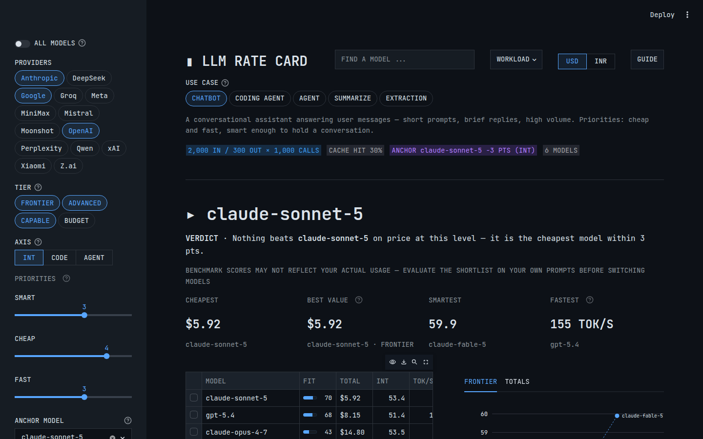

# LLM Rate Card ▮

A Streamlit app that answers two questions: **what does your workload actually cost across LLM APIs**, and **which model is the smartest buy for that money?**

Pick a use-case preset (chatbot, coding agent, summarization, ...) or describe your own workload — input/output tokens per call, number of calls, cache-hit rate, reasoning overhead, Batch API pricing. The verdict at the top names one model and why: the best fit for your SMART/CHEAP/FAST priorities, or — with an anchor set — the cheapest model matching a reference model's intelligence ("Sonnet-level smarts at the lowest price"). Below it: a ranked ledger with scores, speed, usage, and a FIT column, an efficient-frontier chart, and quick cuts (cheapest / best value / smartest / fastest). Every control is bound to the URL, so any comparison is a shareable link.



<details>
<summary>Anchor mode — "who matches claude-sonnet-5 for less?"</summary>



</details>

## No hand-maintained model data

Everything is derived at runtime from live feeds, so new models appear automatically once the feeds list them:

- **Prices** — [LiteLLM's pricing catalog](https://github.com/BerriAI/litellm/blob/main/model_prices_and_context_window.json): per-token input/output, cache read/write, batch prices, context windows, capability flags, deprecation dates.
- **Scores** — [Artificial Analysis](https://artificialanalysis.ai/) intelligence, coding, and agentic indices, from two feeds carrying the same numbers: [OpenRouter's public model listing](https://openrouter.ai/api/v1/models) (no API key, ~90 models, the only source of the agentic index) plus the [Artificial Analysis API](https://artificialanalysis.ai/documentation) itself (free key, 500+ models) filling intelligence/coding for everything OpenRouter's listing lacks.
- **Speed** — the Artificial Analysis API: median output tokens/sec and time-to-first-token per model.
- **Usage** — [OpenRouter's rankings dataset](https://openrouter.ai/data) (`/api/v1/datasets/rankings-daily`, needs an OpenRouter key): tokens/day actually routed per model, averaged over the last 7 days. Real production traffic — what the market runs, not what benchmarks like.

All fetches are cached for an hour and write local JSON snapshots (`model_prices_and_context_window.json`, `benchmark_scores.json`, `aa_models.json`, `usage_rankings.json`) that serve as offline fallbacks — so keyless runs still show the last snapshotted scores, speed, and usage. The only stored mappings are `score_overrides.json` (litellm key → OpenRouter id) and `aa_overrides.json` (litellm key → Artificial Analysis slug) — small crosswalks for models whose names diverge between feeds (e.g. Groq's route-specific Llama names, Artificial Analysis' word order); an unmatched model simply shows blanks.

The catalog itself is computed, not curated:

- **Default view** — every model with both a price and a score (~110 models across all major makers).
- **ALL MODELS** — adds the unscored remainder of the pricing catalog (~250 models).
- Duplicate routes (direct API vs OpenRouter vs Groq) and spelling aliases collapse to one row per model — the maker's own API wins, else the cheapest route.
- Dated snapshots collapse onto their base model; deprecated and zero-priced entries are excluded.
- **Tiers** (FRONTIER / ADVANCED / CAPABLE / BUDGET) are quartiles of the intelligence index across currently scored models — they track the field as it moves.

## Smart selection

- **Use-case presets** — CHATBOT / CODING AGENT / AGENT / SUMMARIZE / EXTRACTION pills set a typical workload shape, the matching score axis (intelligence, coding, or agentic), a sensible tier range (quality-sensitive use cases floor out bottom-tier models that would otherwise win on price alone), the tools filter, and the priority weights in one click; each shows a plain-language description of the use case it models. CHATBOT starts selected so a first visit lands on a concrete comparison. Everything stays editable, and a GUIDE button in the app walks through every control.
- **Priorities → verdict** — SMART/CHEAP/FAST weight sliders produce a FIT score (0–100) per model; the verdict at the top names the best fit and its reasons. FIT is a weighted blend of percentile ranks within the current view — score rank, cheapness rank, speed rank — so a single extreme outlier can't dominate.
- **Anchor query** — pick a model in the sidebar; the view narrows to models scoring within your tolerance of it, ranked by workload cost, with a verdict like *"gemini-3.5-flash matches claude-sonnet-4-6 within 3 pts on INT at $4.20 — 1.8× cheaper."*
- **Efficient frontier** — intelligence (or coding/agentic) vs. workload cost on a log axis, with the Pareto frontier drawn; everything below the line is dominated.
- **Search** — the search box looks up any model by name, maker, or LiteLLM key across the full catalog, bypassing the sidebar filters.
- **Axis toggle** — general intelligence, coding, or agentic index; specialized models rank very differently.

## Optional API keys

Both keys are free-tier and the app makes at most one request per hour per feed. Set them in `.streamlit/secrets.toml` (gitignored) or as environment variables:

```toml
# .streamlit/secrets.toml  (gitignored)
AA_API_KEY = "your-key"          # https://artificialanalysis.ai/ — free, 1,000 req/day
OPENROUTER_API_KEY = "your-key"  # https://openrouter.ai/ — datasets API
```

- `AA_API_KEY` keeps speed (TOK/S column, FASTEST cut, TTFT, the FAST priority weight) and the expanded score coverage live.
- `OPENROUTER_API_KEY` keeps usage (USE B/D column, tokens/day on the rate card) live.

Without a key, each feed serves its committed snapshot — everything still renders, it just ages until the next keyed refresh; elements with no data at all hide gracefully.

## Cost model

- Total = input tokens × effective input price + output tokens × effective output price, × calls.
- *Prompt-cache hit rate*: the cached share of input tokens is billed at each model's cache-read rate. Models without published cache pricing get no discount — which is the point: at 80% hit rate, models with cheap cache reads pull far ahead.
- *Reasoning output multiplier*: reasoning models bill thinking tokens as output; the multiplier applies to reasoning-capable models only.
- *Batch API*: published batch prices replace live prices where available.
- Assumptions: cache math counts reads only (write premiums are a one-time cost per prompt prefix); tokenizers differ across providers, so `tiktoken` estimates are approximate for non-OpenAI models.

## Run locally

```bash
curl -LsSf https://astral.sh/uv/install.sh | sh
uv venv --python 3.11
source .venv/bin/activate
uv pip install -r requirements.txt
streamlit run app.py
```

## URL parameters

| Parameter | Meaning | Example |
|---|---|---|
| `preset` | Use-case preset | `?preset=CODING+AGENT` |
| `q` | Model search (bypasses filters) | `?q=kimi` |
| `prov` | Provider filter (repeatable) | `?prov=Anthropic&prov=Google` |
| `tiers` | Tier filter (repeatable) | `?tiers=FRONTIER` |
| `input_tokens` | Input tokens per call | `?input_tokens=50000` |
| `output_tokens` | Output tokens per call | `?output_tokens=3000` |
| `api_calls` | Number of calls | `?api_calls=1000` |
| `cache` | Prompt-cache hit rate (%) | `?cache=80` |
| `rmult` | Reasoning output multiplier | `?rmult=3.0` |
| `batch` | Batch API pricing | `?batch=true` |
| `w_smart` / `w_cheap` / `w_fast` | Priority weights (0–5) | `?w_fast=5` |
| `anchor` | Anchor model (its catalog name) | `?anchor=claude-sonnet-4-6` |
| `tol` | Anchor tolerance (points) | `?tol=5` |
| `axis` | Score axis | `?axis=CODE` |
| `all` | Include unscored models | `?all=true` |
| `ccy` | Display currency | `?ccy=INR` |
| `need_r` / `need_v` / `need_t` | Require reasoning / vision / tools | `?need_v=true` |

## Design

The interface is a dark blueprint ledger — drafting blue on deep navy, JetBrains Mono throughout, square corners. The entire look lives in `.streamlit/config.toml`: theme colors, webfont, dataframe styling, and the categorical palette that colors the charts. There is no custom CSS.

## Attribution

Intelligence, coding, and agentic scores are [Artificial Analysis](https://artificialanalysis.ai/) indices, served via OpenRouter's model API and the Artificial Analysis API; speed metrics come from the Artificial Analysis API; usage data from OpenRouter's rankings dataset. Prices are from LiteLLM's community-maintained catalog. Exchange rate from exchangerate-api.com.

## The original version

<details>
<summary>Screenshots of this app's first incarnation — a plain cost calculator, before the rate-card redesign</summary>

[LLM API Cost Calculator demo.webm](https://github.com/user-attachments/assets/b7bd21b6-ade2-4d56-b008-203e0724a464)


</details>
