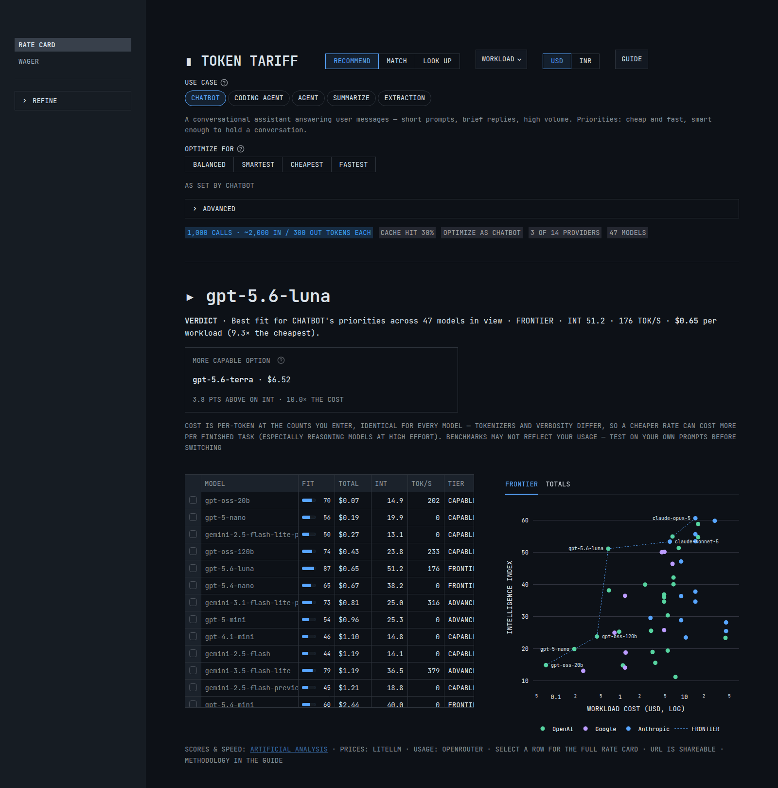
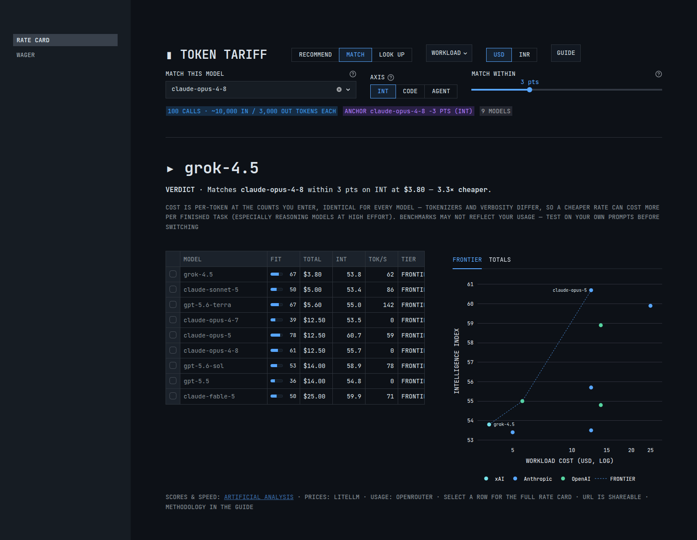
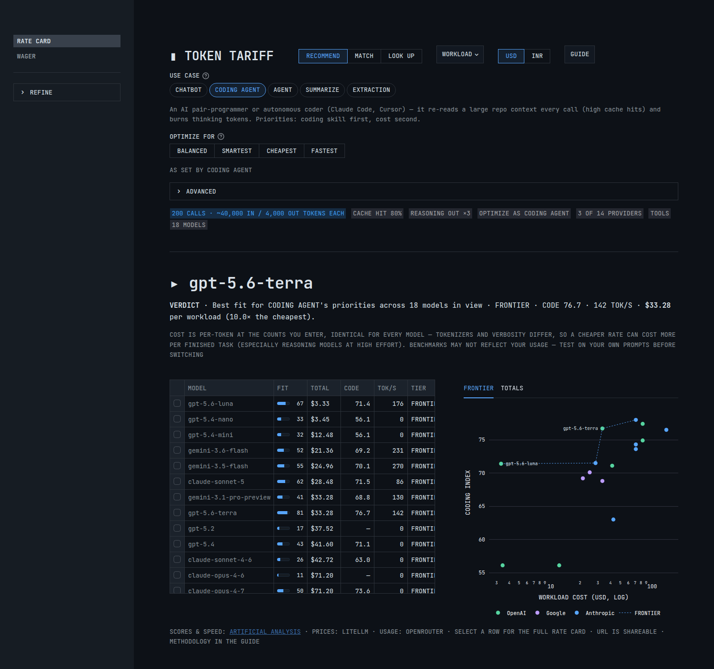
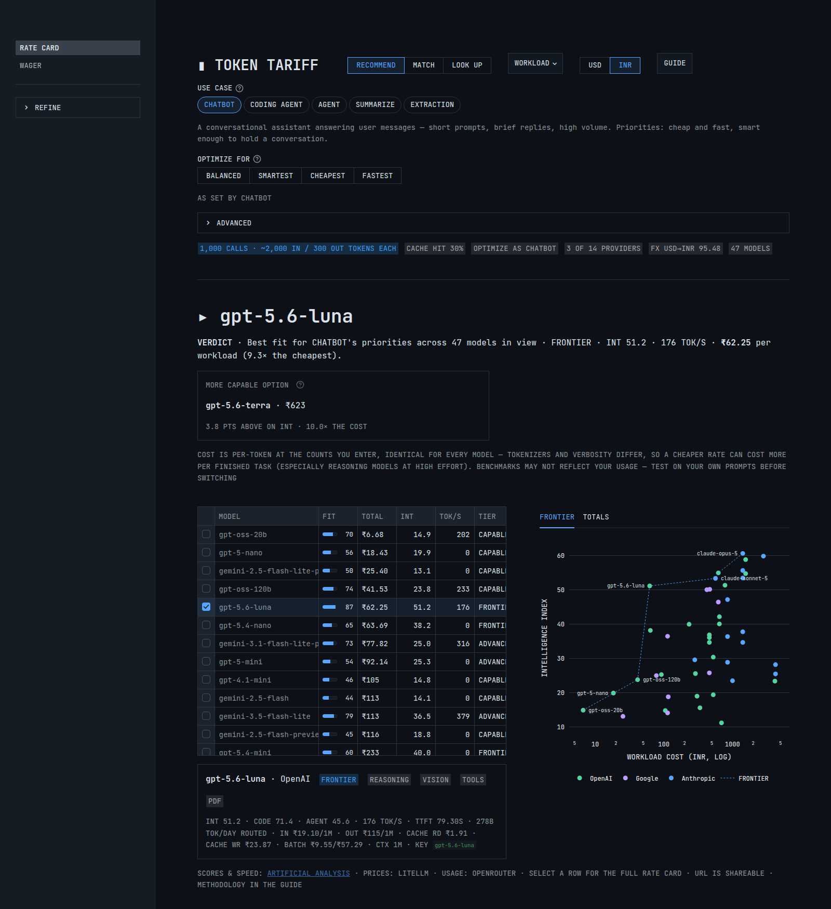

# ▮ Token Tariff

**A live LLM API cost calculator and model-picker.** Describe your workload once and Token Tariff answers two questions at a glance: **what does it cost on every model**, and **which model is the smartest buy for that money?**

**▸ [Live app — token-tariff.streamlit.app](https://token-tariff.streamlit.app/)**

Three modes, one per question. **RECOMMEND** — *what should I use?* Pick a use-case preset (chatbot, coding agent, summarization, …), shape the workload (tokens per call, number of calls, cache-hit rate, reasoning overhead, batch pricing), say what to optimize for, and a **verdict** names one model and why, with a cheaper option and a more capable one beside it. **MATCH** — *the same for less:* name the model you run today and see who holds its score for a smaller bill. **LOOK UP** — *what does X cost?* the whole catalog, searchable, unscored models included. Under every mode: a ranked ledger with scores, speed and real usage, and an efficient-frontier chart. Every control lives in the URL, mode included, so any comparison is a shareable link. Prices and scores refresh hourly from live feeds — nothing is hand-maintained.

<table>
<tr>
<td width="50%" valign="top">
<b>① RECOMMEND — verdict-led picking</b><br/>
<sub>One recommended model with its reasons, the alternatives worth a second look, a cost-ranked ledger, and the efficient frontier.</sub><br/>
<a href="screenshots/01-verdict.png"></a>
</td>
<td width="50%" valign="top">
<b>② MATCH — same smarts, less money</b><br/>
<sub>Name the model you run today; the view keeps only models that match or beat it and names the cheapest. Here: claude-opus-4-8's intelligence for 3.3× less.</sub><br/>
<a href="screenshots/02-anchor.png"></a>
</td>
</tr>
<tr>
<td width="50%" valign="top">
<b>③ Use-case presets</b><br/>
<sub>One click reshapes the whole comparison — workload, score axis, tiers, and priorities. Shown: the coding-agent preset on the coding index.</sub><br/>
<a href="screenshots/03-coding.png"></a>
</td>
<td width="50%" valign="top">
<b>④ Full rate card, any currency</b><br/>
<sub>Select any row for its complete rate card — cache/batch prices, context, capabilities, real tokens/day. USD or INR throughout.</sub><br/>
<a href="screenshots/04-detail-inr.png"></a>
</td>
</tr>
</table>

## How it helps you decide

- **Use-case presets** — CHATBOT / CODING AGENT / AGENT / SUMMARIZE / EXTRACTION each set a typical workload shape, the matching score axis (intelligence, coding, or agentic), a sensible tier range, the required capabilities, and the priority weights in one click — with a plain-language note on what they model. Everything stays editable; edit anything and a PRESET MODIFIED chip offers the way back. An in-app **GUIDE** walks through every mode.
- **Optimize for → verdict** — BALANCED / SMARTEST / CHEAPEST / FASTEST sets the SMART / CHEAP / FAST weights behind a **FIT** score (0–100) per model, and the verdict names the best fit and its reasons; the individual sliders sit under ADVANCED, and weights outside the four read as CUSTOM. FIT is a weighted blend of *percentile ranks* within the current view — score rank, cheapness rank, speed rank — so one extreme outlier can't dominate. It stays a table column: the number moves with the filtered set, the reasons don't.
- **One verdict, two alternatives** — a CHEAPER OPTION (costs less, gives up at most 5 index points) and a MORE CAPABLE OPTION (at least 3 points better, at the lowest cost that buys them), each stating its tradeoff. Neither appears unless something qualifies.
- **MATCH** — name the model you run today and the field narrows to models that match or beat its score (within your tolerance), ranked by workload cost: *"who matches this model's intelligence for less?"*
- **LOOK UP** — find any model by name, maker, or LiteLLM key across the full catalog, unscored models included; an empty box lists everything.
- **Efficient frontier** — score vs. workload cost on a log axis with the Pareto frontier drawn; everything below the line is beaten on both price and score.
- **Axis toggle** — general intelligence, coding, or agentic index; specialized models rank very differently.

## Where the data comes from

Everything is derived at runtime from live feeds, so new models appear automatically once the feeds list them — there is no hand-maintained model list.

| Data | Source |
|---|---|
| **Prices** — per-token in/out, cache, batch, context windows, capability flags, deprecation dates | [LiteLLM pricing catalog](https://github.com/BerriAI/litellm/blob/main/model_prices_and_context_window.json) |
| **Scores** — intelligence, coding, and agentic indices | [Artificial Analysis](https://artificialanalysis.ai/), via [OpenRouter's model listing](https://openrouter.ai/api/v1/models) (keyless, ~90 models, only source of the agentic index) plus the [AA API](https://artificialanalysis.ai/documentation) (free key, 500+ models) filling the gaps |
| **Speed** — median output tokens/sec and time-to-first-token | Artificial Analysis API |
| **Usage** — tokens/day actually routed per model, 7-day average | [OpenRouter rankings dataset](https://openrouter.ai/data) (needs an OpenRouter key) — real production traffic, not benchmark popularity |

Every fetch is cached for an hour and written to a local JSON snapshot (`model_prices_and_context_window.json`, `benchmark_scores.json`, `aa_models.json`, `usage_rankings.json`) that serves as an offline fallback — so keyless runs still render the last snapshotted scores, speed, and usage. The only stored mappings are `score_overrides.json` and `aa_overrides.json` — small crosswalks for models whose names diverge between feeds; an unmatched model simply shows blanks.

**The catalog is computed, not curated:**

- **Default view** — every model with both a price and a score (~110 across all major makers).
- **LOOK UP** — adds the unscored remainder of the pricing catalog (~120 more).
- Duplicate routes (direct API vs. OpenRouter vs. Groq) and spelling/word-order aliases collapse to one row per model — the maker's own API wins, else the cheapest route.
- Dated snapshots collapse onto their base model; deprecated and zero-priced entries are dropped.
- **Tiers** (FRONTIER / ADVANCED / CAPABLE / BUDGET) are live quartiles of the intelligence index across scored models, so they track the field as it moves.

## The cost model

Total cost per model = (input tokens × effective input price + output tokens × effective output price) × calls, where:

- **Prompt-cache hit rate** — the cached share of input tokens is billed at each model's cache-read rate. Models with no published cache pricing get no discount — which is the point: at an 80% hit rate, models with cheap cache reads pull far ahead.
- **Reasoning multiplier** — reasoning models bill thinking tokens as output; the multiplier applies to reasoning-capable models only.
- **Batch API** — published batch prices replace live prices where available (typically ~50% off).

Assumptions: cache math counts reads only (write premiums are a one-time cost per prompt prefix); tokenizers differ across providers, so `tiktoken` estimates are approximate for non-OpenAI models. **Cost is per-token at the token counts you enter, applied identically to every model** — but tokenizers and verbosity differ, so the same task can spend a different number of tokens on each model (reasoning models at high effort especially). A lower per-token rate can still mean a higher cost *per finished task*, so treat the ranking as a screen and confirm on your own workload. **Benchmark scores are likewise a screen, not a guarantee** — always evaluate a shortlist on your own prompts before switching models.

## Run it locally

```bash
curl -LsSf https://astral.sh/uv/install.sh | sh   # skip if you already have uv
uv run streamlit run app.py
```

`uv run` creates the environment from `pyproject.toml` + `uv.lock` on first launch. Dependencies live in `pyproject.toml` (locked in `uv.lock`, installed with [uv](https://docs.astral.sh/uv/)) — there is no `requirements.txt`.

### Optional API keys

Both keys are free-tier, and the app makes at most one request per hour per feed. Set them in `.streamlit/secrets.toml` (gitignored) or as environment variables:

```toml
# .streamlit/secrets.toml
AA_API_KEY = "your-key"          # https://artificialanalysis.ai/ — free, 1,000 req/day
OPENROUTER_API_KEY = "your-key"  # https://openrouter.ai/ — datasets API
```

- `AA_API_KEY` keeps speed (TOK/S, TTFT, the FAST priority) and the expanded score coverage live.
- `OPENROUTER_API_KEY` keeps usage (USE B/D, tokens/day on the rate card) live.

Without a key, each feed serves its committed snapshot — everything still renders, it just ages until the next keyed refresh; elements with no data hide gracefully.

## URL parameters

Every control is bound to the URL, so any view is a shareable link.

| Parameter | Meaning | Example |
|---|---|---|
| `mode` | RECOMMEND, MATCH, or LOOK UP | `?mode=MATCH` |
| `preset` | Use-case preset (RECOMMEND) | `?preset=CODING+AGENT` |
| `q` | Model search (LOOK UP) | `?q=kimi` |
| `prov` | Provider filter (repeatable) | `?prov=Anthropic&prov=Google` |
| `tiers` | Tier filter (repeatable) | `?tiers=FRONTIER` |
| `input_tokens` | Input tokens per call | `?input_tokens=50000` |
| `output_tokens` | Output tokens per call | `?output_tokens=3000` |
| `api_calls` | Number of calls | `?api_calls=1000` |
| `cache` | Prompt-cache hit rate (%) | `?cache=80` |
| `rmult` | Reasoning output multiplier | `?rmult=3.0` |
| `batch` | Batch API pricing | `?batch=true` |
| `opt` | Optimize for (weights outside the four read as CUSTOM) | `?opt=CHEAPEST` |
| `w_smart` / `w_cheap` / `w_fast` | Priority weights (0–5), and what `opt` writes | `?w_fast=5` |
| `anchor` | Reference model, by catalog name (MATCH) | `?anchor=claude-opus-4-8` |
| `tol` | Match tolerance (points) | `?tol=3` |
| `axis` | Score axis | `?axis=CODE` |
| `caps` | Required capabilities (repeatable) | `?caps=VISION&caps=TOOLS` |
| `ccy` | Display currency | `?ccy=INR` |

## The WAGER page

A second page, **WAGER**, asks a different question from the calculator: not what a
model costs today, but how long the frontier stays the frontier. Frontier
intelligence keeps arriving at the cheapest slot in every vendor's lineup a few
months later at a fraction of the price — the page shows that history from sourced
data and then stakes a falsifiable claim on the next repetition.

**The claim.** By **June 27, 2027**, an entry-level model will match Claude Fable
5 — the frontier as of June 2026 — on the Artificial Analysis intelligence index
at no more than a tenth of Fable 5's price.

**Resolves YES** when one entry-level model from Anthropic, OpenAI or Google
reaches Fable 5's launch **Artificial Analysis** index of 59.9, compared inside a
single AA snapshot, at **$2.00 per MTok or less** on a fixed 3:1 input:output
blend. Both terms, one model, at one time. That single arm is the whole rule —
nothing else settles it.

**Resolves NO** when none does by 23:59 UTC on 2027-06-27. The evidence has to be
public by that instant; the AA snapshot and vendor price page proving it may be
captured up to 14 days later.

*Entry-level model* means the slot a vendor designates as its cheapest in its
current lineup — Claude Haiku, OpenAI's mini / nano / Luna slot, Gemini
Flash-Lite. It is the slot, not the price tag: an older, cheaper model still on
sale does not disqualify the current one, and a renamed or replaced slot inherits
eligibility.

| Lens | Date | How it gets there |
|---|---|---|
| **Price decline** | 2027-01-10 | Epoch AI's median 50×/year fall in the price of a fixed capability, counted from Fable 5's release. The wager's price term is a ratio, so this is just the time for a tenfold fall — independent of either sticker price. |
| **Historical lag** | 2027-03-08 | Median 8.9-month lag over 10 matched pairs, from a frontier model setting a new index high to the first entry-level model reaching it. |
| Slowest fitted trend | 2027-06-27 | The price-decline lens at the slowest decline Epoch fitted, 9×/year. The deadline is set here: a trend slower than anything measured would still have landed by this date. Not a confidence bound. |

**These are two illustrative scenarios, not a calibrated forecast.** They land
two months apart, which is not corroboration: capability diffusion and price
decline are two views of the same underlying trend, so both dates ride on it
together. Neither is good to better than a season. January 10 and March 8 are the
forecast; June 27 is the resolution bound — missing the window is not a NO,
missing the deadline is.

Four caveats do most of the work.

- **Matching the index is not general equivalence.** The AA index is an exam-style composite: long-context behaviour and agentic reliability are not in it, and a verbose entry-level model can cost more per finished task than a frontier model at ten times the per-token rate.
- **The arm is a joint event** — the index *and* a tenth of the price, together. The historical-lag lens tracks only capability and the price-decline lens only price, and 3 of the 9 historical matches with a known price cleared the index at less than a tenfold price gap, so they would have failed this wager's own price term.
- **METR is a secondary check, and non-binding.** It has measured no entry-level model in either suite version, and none of Fable 5 either, so it cannot be read today. If both ends are ever measured on one suite version before the deadline, an entry-level model at or above the proxy's p50 is corroboration and nothing more.
- **METR's 50% threshold is not its 80%** — the Mythos preview measures 1,044.8 min at 50% but 185.9 min at 80%.

The 10 matched pairs behind the historical-lag lens come from only **5 catch-up
releases** — one cheap model can clear three standing frontier highs at once — so
treat the effective sample as 5.

### Data and refresh

| Data | Source |
|---|---|
| **50% / 80% time horizons** — the non-binding secondary check | [METR](https://metr.org/time-horizons/), from the published `benchmark_results_1_1.yaml` behind their chart |
| **Intelligence index** | [Artificial Analysis](https://artificialanalysis.ai/), via OpenRouter's listing (read 2026-08-01) and this repo's committed AA API payload (vintage ≤2026-07-05). Each row's `aa_version` says which. Where a model publishes several configurations, the highest-scoring one is recorded, for every row. |
| **Price-decline rate** | [Epoch AI](https://epoch.ai/data-insights/llm-inference-price-trends) — 9× to 900× per year, median 50× |
| **Prices and release dates** | Vendor announcements and pricing docs, archived where the vendor blocks fetches |

Unlike the calculator, this page is **curated, not computed**. `timeline.csv` holds
one row per tracked model, every row carrying a source URL, and a fact that could
not be sourced is left blank rather than estimated. `wager.py` derives everything
else — milestones, lags, both predictions, resolution status — so the page moves
when the data does. `data/history/<date>/` keeps the raw payloads each row was read
from, append-only, because Artificial Analysis re-scores older models when its
index changes and tags no version in either feed.

```bash
uv run python scripts/timeline_fetch.py     # new snapshot + diff vs the last one
```

Then run the `/timeline-refresh` skill, which turns that diff into sourced
`timeline.csv` edits. Roughly quarterly.

`wager.json` is the **frozen** prediction the scheduled emails were built around.
It is deliberately not kept in sync — the page shows a badge when live data has
moved away from it, and that divergence is the point. It is at version 2: a dated
amendment record states what the 2026-08-03 clarification changed (the deadline,
METR demoted to a secondary check, the entry-level definition written as a slot,
the price ceiling stated as a number) and why, and v1 stays in git history. What
must happen is unchanged.

### The scheduled letter

`.github/workflows/wager-email.yml` sends three emails through Resend: a midpoint
check on 2026-10-21, the wager letter on 2027-01-10, and the deadline reading on
2027-06-28 — the morning after the cutoff, so the result is read against a closed
question. Its cron fires on the 10th, 21st and 28th of each month — the day
numbers of those three dates, so each letter arrives on its own date rather than
up to a month late. Re-derive them if `wager.json` is ever re-frozen. A send
counts as done when a labelled GitHub issue with its title exists, which is read
from the API each run — a committed flag can disagree with reality whenever the
write-back commit fails.

**GitHub disables scheduled workflows after 60 days without repository activity.**
The quarterly refresh commit is what keeps this one alive; if the repo goes quiet
for two months, re-enable it from the Actions tab.

```bash
uv run python scripts/wager_check.py --dry-run --as-of 2027-01-10   # render the letter
uv run pytest -q                                                    # the frozen numbers still recompute
```

**Security.** The recipient address and the Resend key exist only as Actions
secrets (`WAGER_EMAIL_TO`, `RESEND_API_KEY`) and appear nowhere in this repo.
With Resend's default test sender, `WAGER_EMAIL_TO` must be the Resend account's
own address; to mail anywhere else, verify a domain and set a `RESEND_FROM`
secret. The
letter template is impersonal, and the issues the workflow opens carry status
only — no address, no letter body. A `gitleaks` workflow scans every push and pull
request, and the refresh skill requires a scan of the staged diff before any
commit, because that step pulls raw API payloads into a public repo.

## Design

The interface is a dark graphite ledger — neutral dark gray, blue used only where it means something, JetBrains Mono throughout, square corners. The entire look lives in `.streamlit/config.toml`: theme colors, webfont, dataframe styling, and the categorical palette that colors the charts. There is no custom CSS.

## Attribution

Intelligence, coding, and agentic scores are [Artificial Analysis](https://artificialanalysis.ai/) indices, served via OpenRouter's model API and the Artificial Analysis API; speed metrics come from the Artificial Analysis API; usage data from OpenRouter's rankings dataset. Prices are from LiteLLM's community-maintained catalog. Exchange rate from exchangerate-api.com.

## The original version

<details>
<summary>Screenshots of this app's first incarnation — a plain cost calculator, before the rate-card redesign that became Token Tariff.</summary>

[LLM API Cost Calculator demo.webm](https://github.com/user-attachments/assets/b7bd21b6-ade2-4d56-b008-203e0724a464)


</details>
